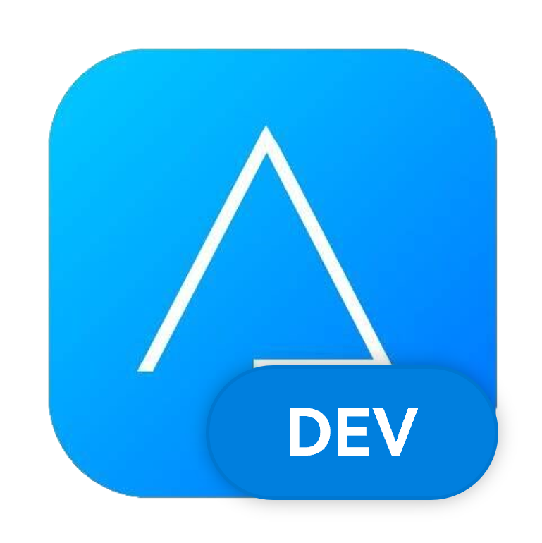

## Dev开发部

成立于2019年，由Noah Zhu创建，是一个软件开发工作室，成立本工作室是因为Floppy β Studio的暂时解散，为了继续开发软件而建。

### 历史

2019年，AuroraStudio成立，继续浏览器的开发。

2020年，AuroraStudio初具规模，核心成员大量加入。

2021年，Noah Zhu反映其浏览器项目和Aurora Hardware Check源码遭到不明泄露，泄露的项目被紧急改写重新设计，更新更多功能，此事受到了很多B站UP们的关心。

2022年，开发4年之久的Neutrino于2月2日公测，取得了一定成功。