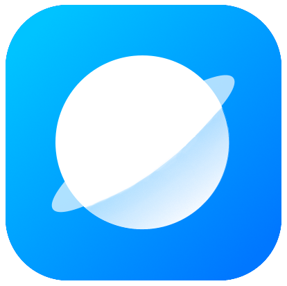

## 关于Neutrino

Neutrino是Noah Zhu从2019年起开发的一款网页浏览器，使用Chromium内核，从前叫做WebWorld。

本项目曾经被多次重构，并且经历过一次源码泄露，是AuroraStudio中开发时间最长的一个项目，本项目在2022年1月完成内部测试以后便在2月2日对外公测。

本项目尚未发布正式版，并且在长期内也是如此。

## Neutrino亮点

- 支持Mica和亚克力，以及Windows 7的Aero效果
- 标签页管理
- 使用Direct2D，界面加载高效
- 拥有各种各样的BUG

## Neutrino其他信息

官网：https://aurorast.cn/neutrino

Neutrino最低需要安装在安装了Platform Update的Windows 7 SP1上。

## 相关视频：

<iframe src="//player.bilibili.com/player.html?aid=463281354&bvid=BV1GL411s7Tt&cid=417119580&page=1" scrolling="no" border="0" frameborder="no" framespacing="0" allowfullscreen="true"> </iframe>

<iframe src="//player.bilibili.com/player.html?aid=678023756&bvid=BV15m4y1D7zt&cid=482207707&page=1" scrolling="no" border="0" frameborder="no" framespacing="0" allowfullscreen="true"> </iframe>

