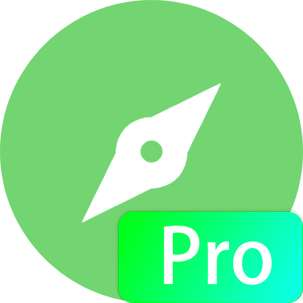
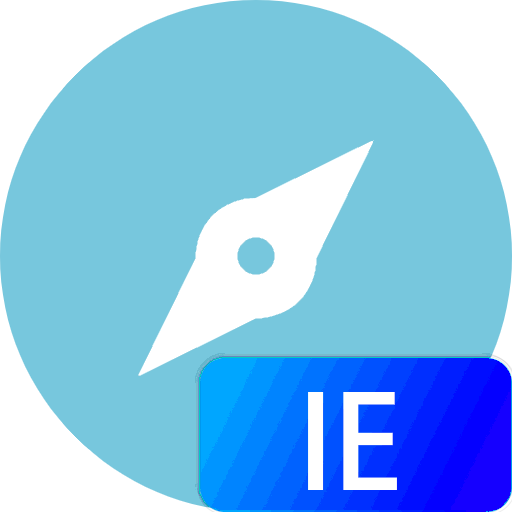

## 关于What Damon Browser

What Damon Browser（简称“WDB”）是由What_Damon于2018年12月开始开发的应急性质浏览器，在首次重写前称为Windows浏览器，有普通版和Pro版（两者都免费，两者的差别在内核上）。

WDB是What_Damon的第一个正式项目，由于代码处理不当，目前本项目永久停止开发。

## What Damon Browser亮点

- 轻量化
- 双核
- 足够用美观

## What Damon Browser其他信息

本软件在Windows 10下运行最佳，最低支持Windows XP

## 相关视频

<iframe src="//player.bilibili.com/player.html?aid=83854240&bvid=BV11J411E7WH&cid=143446775&page=1" scrolling="no" border="0" frameborder="no" framespacing="0" allowfullscreen="true"> </iframe>

